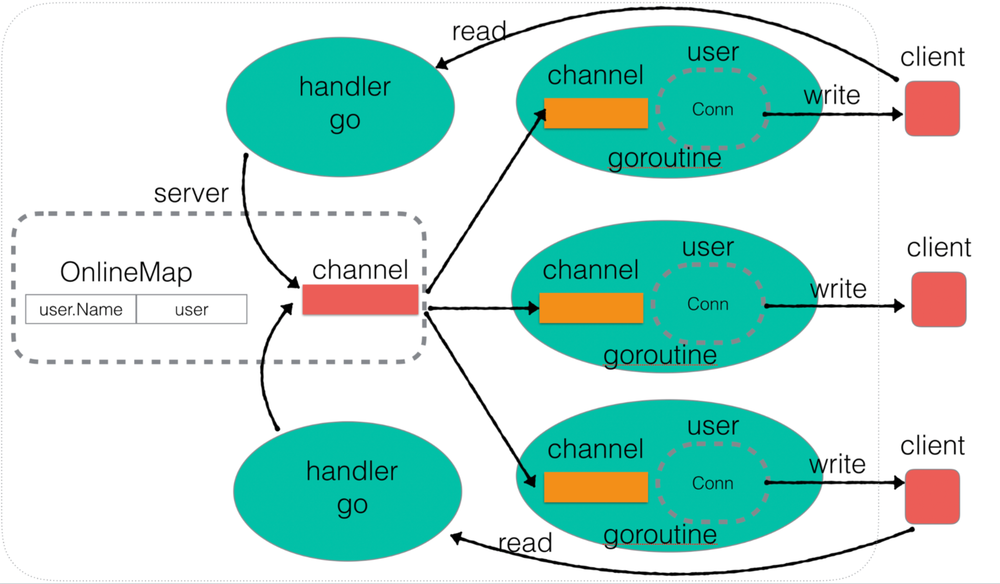

# IM_System_Go
An instant messaging system using go language

## Overall architecture


## Versions and functions
- Version 1: Basic server
- Version 2: User online and broadcast
- Version 3: User message broadcast
- Version 4: Business decoupling and encapsulation: move user online, offline and send message logic to user.go
- Version 5: Add function to query online users
- Version 6: Add function to change user name
- Version 7: Add function to force user offline after timeout
- Version 8: Support private masseges
- Version 9: Add client module to replace the nc method

## To run

- Build server:

```bash
go build -o server server.go main.go user.go
```

- Build client:

```bash
go build -o client client.go
```

- Run server:

```bash
./server
```

- Run client:

```bash
./client
```